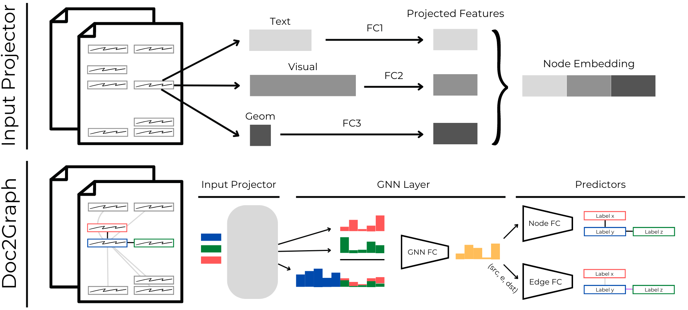

# <p align=center>`Doc2Graph`</p> 



[](https://paperswithcode.com/sota/entity-linking-on-funsd?p=doc2graph-a-task-agnostic-document) [](https://paperswithcode.com/sota/semantic-entity-labeling-on-funsd?p=doc2graph-a-task-agnostic-document)

 

This library is the implementation of the paper [Doc2Graph: a Task Agnostic Document Understanding Framework based on Graph Neural Networks](https://arxiv.org/abs/2208.11168), accepted at [TiE @ ECCV 2022](https://sites.google.com/view/tie-eccv2022/accepted-papers?authuser=0).

The model and pipeline aims at being task-agnostic on the domain of Document Understanding. It is an ongoing project, these are the steps already achieved and the ones we would like to implement in the future:

- [x] Build a model based on GNNs to spot key-value relationships on forms
- [x] Publish the preliminary results and the code
- [x] Extend the framework to other document-related tasks
  - [x] Business documents Layout Analysis
  - [x] Table Detection
- [ ] Let the user train Doc2Graph over private / other datasets using our dataloader
- [ ] Transform Doc2Graph into a PyPI package

Index:
- [`Doc2Graph`](#doc2graph)
  - [News!](#news)
  - [Environment Setup](#environment-setup)
  - [Training](#training)
  - [Testing](#testing)
  - [Cite this project](#cite-this-project)

---
## News!
- 🔥 Added **inference** method: you can now use Doc2Graph directly on your documents simply passing a path to them! <br> This call will output an image with the connected entities and a json / dictionary with all the useful information you need! 🤗
```
python src/main.py -addG -addT -addE -addV --gpu 0 --weights e2e-funsd-best.pt --inference --docs /path/to/document
```
  
- 🔥 Added **tutorial** folder: get to know how to use Doc2Graph from the tutorial notebooks!

## Environment Setup
Setup the initial conda environment

```
conda create -n doc2graph python=3.9 ipython cudatoolkit=11.3 -c anaconda &&
conda activate doc2graph &&
cd doc2graph
```

Then, install [setuptools-git-versioning](https://pypi.org/project/setuptools-git-versioning/) and doc2graph package itself. The following has been tested only on linux: for different OS installations refer directly to [PyTorch](https://pytorch.org/get-started/previous-versions/) and [DGL](https://www.dgl.ai/pages/start.html) original documentation.

```
pip install torch==1.11.0+cu113 torchvision==0.12.0+cu113 torchaudio==0.11.0 --extra-index-url &&
https://download.pytorch.org/whl/cu113 &&
pip install dgl-cu113 dglgo -f https://data.dgl.ai/wheels/repo.html &&
pip install setuptools-git-versioning && pip install -e . &&
pip install https://github.com/explosion/spacy-models/releases/download/en_core_web_lg-3.3.0/en_core_web_lg-3.3.0.tar.gz
```

Finally, create the project folder structure and download data:

```
python src/main.py --init
```
The script will download and setup:
- FUNSD and the 'adjusted_annotations' for FUNSD[^1] are given by the work of[^3].
- The yolo detection bbox described in the paper (If you want to use YOLOv5-small to detect entities, script in `notebooks/YOLO.ipynb`, refer to [their github](https://github.com/ultralytics/yolov5) for the installation. Clone the repository into `src/models/yolov5`).
- The Pau Riba's[^2] dataset with our train / test split.

[^1]: G. Jaume et al., FUNSD: A Dataset for Form Understanding in Noisy Scanned Documents, ICDARW 2019
[^2]: P. Riba et al, Table Detection in Invoice Documents by Graph Neural Networks, ICDAR 2019
[^3]: Hieu M. Vu et al., REVISING FUNSD DATASET FOR KEY-VALUE DETECTION IN DOCUMENT IMAGES, arXiv preprint 2020

**Checkpoints**
You can download our model checkpoints [here](https://drive.google.com/file/d/15jKWYLTcb8VwE7XY_jcRvZTAmqy_ElJ_/view?usp=sharing). Place them into `src/models/checkpoints`.

---
## Training
1. To train our **Doc2Graph** model (using CPU) use:
```
python src/main.py [SETTINGS]
```
2. Instead, to test a trained **Doc2Graph** model (using GPU) [weights can be one or more file]:
```
python src/main.py [SETTINGS] --gpu 0 --test --weights *.pt
```
The project can be customized either changing directly `configs/base.yaml` file or providing these flags when calling `src/main.py`.

**Features**
 - --add-geom: bool (to add positional features to graph nodes)
 - --add-embs: bool (to add textual features to graph nodes)
 - --add-hist: bool (to add visual features to graph nodes)
 - --add-visual: bool (to add visual features to graph nodes)
 - --add-eweights: bool (to add polar relative coordinates between nodes to graph edges)

**Data**
 - --src-data: string [FUNSD, PAU or CUSTOM] (CUSTOM still under dev)
 - --src-type: string [img, pdf] (if src_data is CUSTOM, still under dev)

**Graphs**
 - --edge-type: string [fully, knn] (to change the kind of connectivity)
 - --node-granularity: string [gt, yolo, ocr] (choose the granularity of nodes to be used, gt (if given), ocr (words) or yolo (entities))
 - --num-polar-bins: int [Default 8] (number of bins into which discretize the space for edge polar features. It must be a power of 2)

 **Inference (only for KiE)**
 - --inference: bool (run inference on given document/s path/s)
 - --docs: list (list your absolute path to your document)

Change directly `configs/train.yaml` for training settings or pass these flags to `src/main.py`. To create your own model (changing hyperparams) copy `configs/models/*.yaml`. 

**Training/Testing**
- --model: string [e2e, edge, gcn] (which model to use, which yaml file to load)
- --gpu: int [Default -1] (which GPU to use. Set -1 to use CPU(
- --test: true / false (skip training if true)
- --weights: strin(s) (provide weight file(s) relative path(s), if testing)

## Testing

You can use our pretrained models over the test sets of FUNSD[^1] and Pau Riba's[^2] datasets.

1. On FUNSD we were able to perform both Semantic Entity Labeling and Entity Linking:

**E2E-FUNSD-GT**:
```
python src/main.py -addG -addT -addE -addV --gpu 0 --test --weights e2e-funsd-best.pt
```

**E2E-FUNSD-YOLO**:
```
python src/main.py -addG -addT -addE -addV --gpu 0 --test --weights e2e-funsd-best.pt --node-granularity yolo
```

2. on Pau Riba's dataset, we were able to perform both Layout Analysis and Table Detection

**E2E-PAU**:
```
python src/main.py -addG -addT -addE -addV --gpu 0 --test --weights e2e-pau-best.pt --src-data PAU --edge-type knn
```
  
---
## Cite this project
If you want to use our code in your project(s), please cite us:
```
@InProceedings{10.1007/978-3-031-25069-9_22,
author="Gemelli, Andrea
and Biswas, Sanket
and Civitelli, Enrico
and Llad{\'o}s, Josep
and Marinai, Simone",
editor="Karlinsky, Leonid
and Michaeli, Tomer
and Nishino, Ko",
title="Doc2Graph: A Task Agnostic Document Understanding Framework Based on Graph Neural Networks",
booktitle="Computer Vision -- ECCV 2022 Workshops",
year="2023",
publisher="Springer Nature Switzerland",
address="Cham",
pages="329--344",
abstract="Geometric Deep Learning has recently attracted significant interest in a wide range of machine learning fields, including document analysis. The application of Graph Neural Networks (GNNs) has become crucial in various document-related tasks since they can unravel important structural patterns, fundamental in key information extraction processes. Previous works in the literature propose task-driven models and do not take into account the full power of graphs. We propose Doc2Graph, a task-agnostic document understanding framework based on a GNN model, to solve different tasks given different types of documents. We evaluated our approach on two challenging datasets for key information extraction in form understanding, invoice layout analysis and table detection. Our code is freely accessible on https://github.com/andreagemelli/doc2graph.",
isbn="978-3-031-25069-9"
}
```
